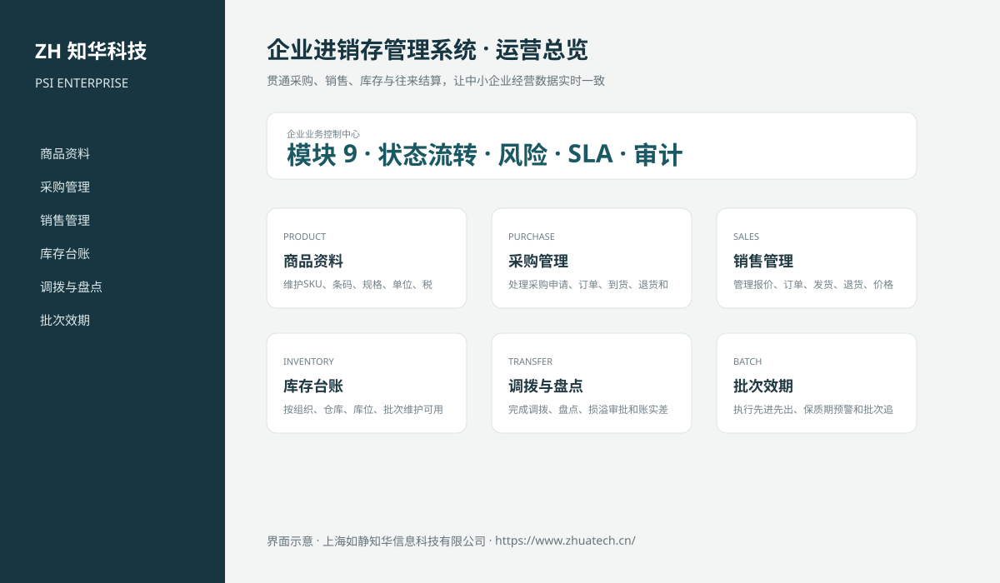
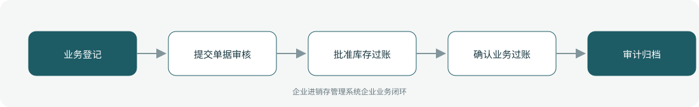

# ZhuaTech PSI｜企业进销存管理系统

> 贯通采购、销售、库存与往来结算，让中小企业经营数据实时一致

ZhuaTech PSI 是知华科技（上海如静知华信息科技有限公司）发布的企业级源码项目，面向“商品、供应商、客户、采购、销售、入出库、调拨、盘点、批次、应收应付与经营分析”提供管理端与响应式业务端。工程采用前后端分离架构，所有示例数据均为虚构数据。

[知华科技官网](https://www.zhuatech.cn/) · [架构说明](docs/ARCHITECTURE.md) · [API 文档](docs/API.md) · [企业能力](docs/ENTERPRISE.md) · [测试说明](docs/TESTING.md)



## 业务模块

| 模块 | 核心能力 |
| --- | --- |
| 商品资料 | 维护SKU、条码、规格、单位、税率、批次和保质期 |
| 采购管理 | 处理采购申请、订单、到货、退货和供应商交期 |
| 销售管理 | 管理报价、订单、发货、退货、价格和客户信用 |
| 库存台账 | 按组织、仓库、库位、批次维护可用和锁定库存 |
| 调拨与盘点 | 完成调拨、盘点、损溢审批和账实差异闭环 |
| 批次效期 | 执行先进先出、保质期预警和批次追溯 |
| 往来结算 | 生成应收应付、收付款、核销和客户供应商对账 |
| 成本核算 | 支持移动平均成本、毛利和库存金额分析 |
| 经营分析 | 分析采购、销售、周转、滞销、缺货和利润 |



## 本次深化的核心交易能力

- 独立库存余额与不可变库存流水，不再以通用台账模拟库存；
- 采购入库、销售出库、退货、调整、预留、释放和跨仓调拨；
- 过账幂等键、数据库悲观锁与唯一约束共同防止重复扣减；
- 按“在手 − 预留”计算可用库存，服务端强制禁止负库存；
- 跨仓调拨在单一事务内完成调出、调入，任一失败整体回滚；
- 前端新增库存过账工作台，可直接维护余额并查看最近流水。

## 企业级控制

- ADMIN / OPERATOR 角色边界和管理员接口隔离；
- 服务端字段、模块、唯一编号和状态迁移校验；
- 组织、期间、责任人、风险等级、到期日和 SLA 统计；
- 幂等创建、JPA 乐观锁、重复提交保护和职责分离；
- 附件 SHA-256 元数据、业务凭证完整性与全流程审计；
- 组合检索、分页、逾期筛选、UTF-8 CSV 导出和协作时间线；
- 外部系统仅预留适配器，使用方自行配置地址与凭据；
- prod profile 拒绝默认密码、弱数据库口令和本地跨域来源。

## 技术架构

- 后端：Java 21、Spring Boot、Spring Security、JPA、Bean Validation、Actuator
- 前端：Vue 3、Vite、Axios，支持桌面端与移动端响应式布局
- 数据库：MySQL 8；自动化测试使用 H2
- 交付：Docker Compose、Nginx、环境变量、GitHub Actions
- Java 包名：`cn.zhuatech.psi`

## 启动与测试

```bash
cd backend && mvn test
cd ../frontend && npm install && npm run build
cd .. && cp .env.example .env && docker compose up --build
```

开发演示账号：`admin / admin123`、`operator / operator123`。生产环境必须通过环境变量替换全部默认凭据。

## 许可与商业授权

Copyright © 2026 上海如静知华信息科技有限公司。

本工程仅允许个人学习、研究和非商业技术交流，**不得用于商业用途**。企业内部使用、生产部署、SaaS运营、项目交付、品牌替换、收费培训、咨询实施或再分发，均须事先获得上海如静知华信息科技有限公司书面授权，详见 [LICENSE](LICENSE)。

深度开发、私有化部署、系统集成与企业数字化咨询，请访问[知华科技官网](https://www.zhuatech.cn/)或扫码联系：

| 微信咨询一 | 微信咨询二 |
| --- | --- |
|  |  |

SEO：企业进销存管理系统、PSI系统源码、企业数字化、Java企业系统、Vue管理系统、知华科技、上海如静知华信息科技有限公司。
